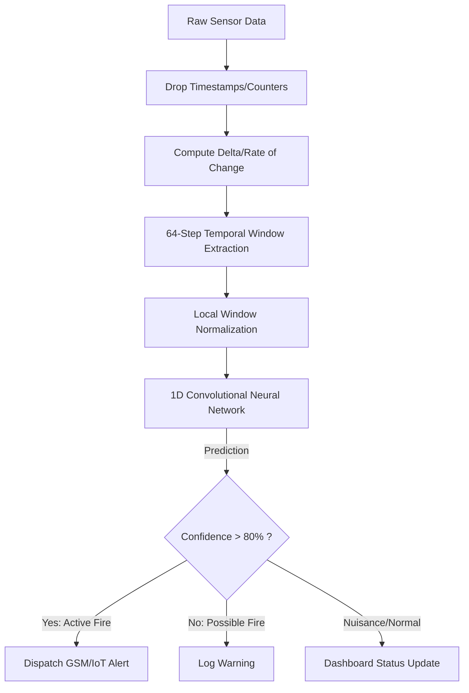

# Intelligent Fire Detection System (Software Simulation)

## Project Overview
This project is a software-simulated end-to-end implementation of an Intelligent Fire Detection System, developed as a final-year CSC 476 project (Group 21/18).

The original proposal specifies an embedded hardware system incorporating multi-sensor fusion (PIR flame sensor, electrochemical smoke sensor, MLX90614 thermal sensor) and GSM/IoT alerting capabilities. Due to current hardware unavailability, this repository provides a **fully functional software simulation** of the entire pipeline. 

## Hardware Integration Status
**Current Build:** Full Software Simulation
Physical sensor procurement is pending. The system currently uses the Kaggle "Smoke Detection Dataset" to simulate live sensor data streaming. The alerting mechanism (GSM/IoT) is mocked using the `AlertDispatcher` interface, which logs events and prints console alerts. A future physical GSM/IoT module can be easily integrated by extending this interface.

## The Engineering Journey
This pipeline evolved significantly during testing to guarantee robust real-world generalization:
1. **Data Leakage Found and Fixed:** Initially, `UTC` and sequential `CNT` identifiers were accidentally included in the features. The model memorized timestamps rather than learning fire signatures. These were explicitly stripped out.
2. **Calibration Drift Found and Fixed:** The Kaggle dataset was recorded across several disconnected experiments (Segments). We discovered massive absolute baseline shifts between these segments (e.g., normal temperature varying from 6°C to 33°C). A global scaling approach caused catastrophic failure. We fixed this by implementing **per-segment local normalization** and **computing rate-of-change delta features**, forcing the model to learn the relative *shape* of a fire rather than absolute background noise.
3. **Architecture Evolution (MLP to 1D CNN):** The initial DWT (Discrete Wavelet Transform) + MLP approach was structurally incapable of discerning between rapid but harmless Nuisance fluctuations and steady Active Fire escalations, because DWT flattened the temporal sequence. We evolved the architecture to a **1D Convolutional Neural Network (CNN)** that ingests raw 3D sequential tensors (64 time-steps). This sequence-aware model successfully eliminated the Nuisance/Fire overlap.

## Pipeline Architecture



## Setup Instructions

### 1. Install Dependencies
Ensure you have Python 3.8+ installed.
```bash
pip install -r requirements.txt
```

### 2. Prepare the Dataset
The data loader uses `kagglehub` to automatically download the [Kaggle Smoke Detection Dataset](https://www.kaggle.com/datasets/deepcontractor/smoke-detection-dataset). 

### 3. Run the Dashboard
Launch the live simulation dashboard which feeds data into the Production CNN model:
```bash
$env:PYTHONPATH="." ; streamlit run app/dashboard.py
```
*(On Unix systems, use `PYTHONPATH=. streamlit run app/dashboard.py`)*

## Model Performance Metrics
The system currently achieves an exceptionally safe operational state on the test set:
- **0% Missed Fires:** 100% Recall on Active Fire.
- **98% Fire Precision:** False alarms are practically nonexistent.
- **84% Nuisance Recall:** Accurately distinguishes harmless spikes from real fires.

### Final Classification Report
```text
              precision    recall  f1-score   support

      Normal       1.00      0.57      0.73       121
    Nuisance       0.52      0.84      0.64        55
 Active Fire       0.98      1.00      0.99       778

    accuracy                           0.94       954
```

### Final Confusion Matrix
```text
[[ 69  43   9]   <-- True Normal
 [  0  46   9]   <-- True Nuisance
 [  0   0 778]]  <-- True Active Fire
```
See `reports/confusion_matrix.png` for the visual matrix plot.
